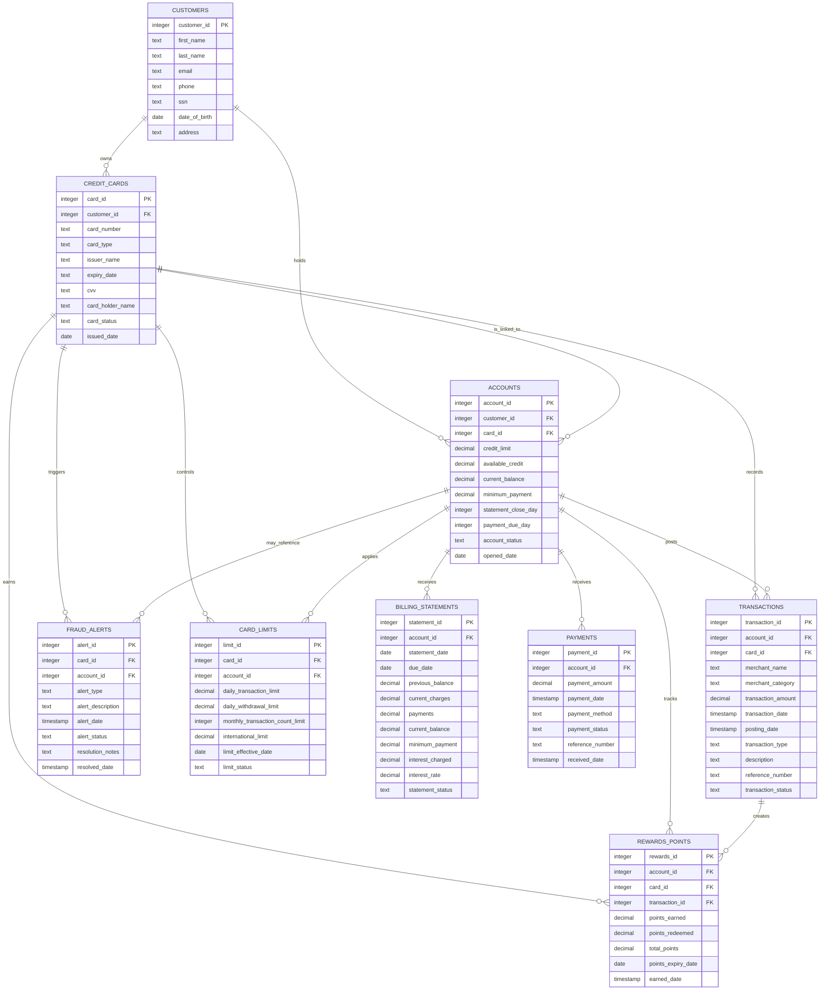

# Bank Credit Card Data Model Document

## Overview

This repository implements a relational banking data model for customer profiles, issued credit cards, linked accounts, card transactions, payments, billing statements, fraud alerts, rewards points, and operational card limits.

The data model is designed around a single business domain:

- A bank serves customers.
- A customer can hold one or more credit cards.
- Each credit card can map to one or more accounts.
- Accounts carry financial exposure and payment obligations.
- Transactions, billing statements, payments, alerts, rewards, and card limits are operational facts around the relationship between customer and credit account.

## Data Architecture

The data is represented in PostgreSQL-compatible relational tables with explicit primary keys and foreign-key relationships.

## Entity Relationship Summary

| Entity | Primary Key | Main Foreign Keys | Relationship Type | Business Summary |
|---|---|---|---|---|
| customers | customer_id | None | Parent of cards, accounts | Identity and profile record for a bank customer |
| credit_cards | card_id | customer_id | Child of customers; parent of accounts, transactions, alerts, limits, rewards | Issued bank card product |
| accounts | account_id | customer_id, card_id | Child of customers and credit_cards; parent of transactions, statements, payments, limits, rewards | Financial account and credit container |
| transactions | transaction_id | account_id, card_id | Child of accounts and card; may feed rewards | Purchase or payment card event |
| billing_statements | statement_id | account_id | Child of accounts | Monthly financial statement snapshot |
| payments | payment_id | account_id | Child of accounts | Cash flow applied to an account |
| fraud_alerts | alert_id | card_id, account_id | Child of card, optional linkage to account | Risk and investigation artifact |
| rewards_points | rewards_id | account_id, card_id, transaction_id | Child of account, card, optionally transaction | Loyalty or rewards ledger |
| card_limits | limit_id | card_id, account_id | Child of card and account | Operational policy thresholds |

## Entity Cardinality Rules

| Parent | Child | Cardinality | Explanation |
|---|---|---|---|
| customers | credit_cards | 1:N | A customer may have multiple credit cards |
| customers | accounts | 1:N | A customer may have multiple accounts |
| credit_cards | accounts | 1:N | A card may be associated with multiple accounts |
| credit_cards | transactions | 1:N | A card can have many posted events |
| accounts | transactions | 1:N | An account can have many transactions |
| accounts | billing_statements | 1:N | An account can have many monthly statement records |
| accounts | payments | 1:N | An account can have many inbound payments |
| credit_cards | fraud_alerts | 1:N | A card may produce many alerts |
| accounts | fraud_alerts | 1:N optional | An alert may optionally relate to a specific account |
| transactions | rewards_points | 1:N optional | A transaction may produce multiple reward point events |
| credit_cards | card_limits | 1:N | A card can have one or more limit policy rows |
| accounts | card_limits | 1:N | An account can carry one or more limit policy rows |

## Integrity and Derived-Data Rules

The DDL already implies a relational integrity model:

- A card cannot exist without a customer.
- A transaction should always belong to a valid account and card.
- A payment should always belong to a valid account.
- A billing statement should always belong to a valid account.
- A rewards point record should belong to a valid account and card, and may optionally be generated from a transaction.
- A fraud alert should belong to a valid card and may optionally belong to an account.
- Limit rows should belong to a valid card and account.

Derived operational constraints that should stay consistent in future logic:

- available_credit should remain compatible with the current account balance and credit configuration.
- current_balance should reflect posted transaction and payment movement.
- statement summaries should stay mapable to account facts.
- card_status, account_status, and limit_status should be recorded as normalized status concepts at the business layer.

## Reporting and Analytics Views

The current repository does not yet define analytics views, but the schema can support a number of common operational queries.

### Suggested view topics

1. Customer card and account overview
2. Current balance and available-credit view
3. Monthly statement and payment exposure view
4. Transactions by merchant category and card
5. Fraud alert status and resolution history
6. Rewards point balance trend
7. Card limit compliance exposure

### Example SQL view structure

```sql
CREATE VIEW customer_account_overview AS
SELECT
    c.customer_id,
    c.first_name,
    c.last_name,
    cc.card_id,
    cc.card_number,
    cc.card_type,
    a.account_id,
    a.credit_limit,
    a.available_credit,
    a.current_balance,
    a.account_status
FROM customers c
JOIN credit_cards cc ON cc.customer_id = c.customer_id
JOIN accounts a ON a.customer_id = c.customer_id AND a.card_id = cc.card_id;
```

```sql
CREATE VIEW transaction_summary AS
SELECT
    t.transaction_id,
    t.account_id,
    t.card_id,
    t.merchant_name,
    t.merchant_category,
    t.transaction_amount,
    t.transaction_date,
    t.transaction_status,
    a.customer_id
FROM transactions t
JOIN accounts a ON a.account_id = t.account_id;
```

## Mermaid Entity Relationship Diagram



## Normalization and Data Quality Considerations

This schema is already close to a normalized, third-normal-form relational design for a small domain model.

Normalization observations:

- Customer identity is stored once in the customer table and referenced by other tables.
- Card information is isolated in the credit card table, not repeated inside transactions or accounts.
- Account financial values are managed centrally in the account table.
- Transaction events are stored as facts rather than columns that repeat across accounts or statements.
- Payment activity is stored as a separate type of account event rather than being denormalized into statements.
- Reporting-only or derived values such as statement balances and rewards totals are represented as rows, not flattened into the source transaction table.

Recommended quality controls for future implementation:

- Enforce valid status values through domain checks or lookup tables.
- Validate that statement balance totals and payment totals reconcile.
- Enforce that payment amounts are non-negative and merchant or transaction references are unique where appropriate.
- Ensure reward point balances are recomputed against actual transaction movement if points are treated as operational balances.

## Domain Glossary

- Customer: party that owns identity data and is the natural root of the card/account model.
- Card: payment instrument issued by a bank.
- Account: balance and credit relationship that receives transactions and payments.
- Statement: monthly view of debt, payment, and interest exposure.
- Payment: payment instrument or settlement event describing account funding.
- Fraud Alert: operational event doing risk or dispute investigation.
- Rewards Points: loyalty ledger linked to card-level activity.
- Card Limits: controls that constrain operational activity.

## Design Notes

This model is currently schema-first and sample-data-driven. The future application layer can consume these tables directly or build views over them, but the relational structure should remain the source of truth.

The naming and vocabulary in this model are already aligned with bank product language and support a credit-card product domain rather than a generic payment table archive.

### 1. customers

Stores customer profile information.

| Column | Type | Description |
|---|---|---|
| customer_id | INTEGER PK | Unique customer identifier |
| first_name | TEXT | Customer given name |
| last_name | TEXT | Customer family name |
| email | TEXT UNIQUE | Customer email address |
| phone | TEXT | Customer phone number |
| ssn | TEXT UNIQUE | SSN-like identifier used for identity management |
| date_of_birth | DATE | Customer date of birth |
| address | TEXT | Street address |
| city | TEXT | City |
| state | TEXT | State or province |
| zip_code | TEXT | Postal / ZIP code |
| country | TEXT | Country |
| customer_status | TEXT | Lifecycle status such as active |
| created_at | TIMESTAMP | Audit timestamp |
| updated_at | TIMESTAMP | Audit timestamp |

Business meaning:

- A customer is the master party record.
- Customer email, phone, and SSN identifier fields must be unique where appropriate.
- A customer can own multiple card/account records.

### 2. credit_cards

Stores bank-issued card records associated with a customer.

| Column | Type | Description |
|---|---|---|
| card_id | INTEGER PK | Unique card identifier |
| customer_id | INTEGER FK | Owning customer |
| card_number | TEXT UNIQUE | Card number stored as text |
| card_type | TEXT | Visa, Mastercard, etc. |
| issuer_name | TEXT | Issuer / bank name |
| expiry_date | TEXT | Expiry month/year format |
| cvv | TEXT | Card verification value |
| card_holder_name | TEXT | Name displayed on the card |
| card_status | TEXT | Card lifecycle status |
| issued_date | DATE | Date the card was issued |
| created_at | TIMESTAMP | Audit timestamp |

Business meaning:

- A credit card belongs to exactly one customer.
- Each card has a unique card number.
- Card status is used for lifecycle operations and bank controls.

### 3. accounts

Stores the credit account relationship between a customer and a card.

| Column | Type | Description |
|---|---|---|
| account_id | INTEGER PK | Unique account identifier |
| customer_id | INTEGER FK | Customer owning the account |
| card_id | INTEGER FK | Card associated with the account |
| credit_limit | DECIMAL(12,2) | Total credit line |
| available_credit | DECIMAL(12,2) | Current amount available to spend |
| current_balance | DECIMAL(12,2) | Current balance due / outstanding |
| minimum_payment | DECIMAL(12,2) | Minimum monthly amount due |
| statement_close_day | INTEGER | Billing period closing day |
| payment_due_day | INTEGER | Customer payment due date |
| account_status | TEXT | Account lifecycle status |
| opened_date | DATE | Account opening date |
| created_at | TIMESTAMP | Audit timestamp |

Business meaning:

- The account is the financial container for card exposure.
- The account stores balance and credit capacity.
- The available credit should be derived or validated against the configured line and activity.

### 4. transactions

Stores purchase and credit-card activity against an account/card.

| Column | Type | Description |
|---|---|---|
| transaction_id | INTEGER PK | Unique transaction identifier |
| account_id | INTEGER FK | Account affected |
| card_id | INTEGER FK | Card used for the transaction |
| merchant_name | TEXT | Merchant name |
| merchant_category | TEXT | Merchant category classification |
| transaction_amount | DECIMAL(12,2) | Amount of the transaction |
| transaction_date | TIMESTAMP | Date/time transaction occurred |
| posting_date | TIMESTAMP | Date transaction posted to account |
| transaction_type | TEXT | Purchase, refund, cash advance, etc. |
| description | TEXT | Extra narrative detail |
| reference_number | TEXT UNIQUE | External or internal reference |
| transaction_status | TEXT | Status such as posted |
| created_at | TIMESTAMP | Audit timestamp |

Business meaning:

- Transactions represent a fact about consumption or payment activity.
- They tie back to a card and account for financial reporting.
- A transaction can be used as a base for rewards and risk monitoring.

### 5. billing_statements

Stores monthly billing statement output for a credit account.

| Column | Type | Description |
|---|---|---|
| statement_id | INTEGER PK | Unique statement identifier |
| account_id | INTEGER FK | Account affected |
| statement_date | DATE | Statement generation month/date |
| due_date | DATE | Amount due date |
| previous_balance | DECIMAL(12,2) | Carry-forward balance from prior statement |
| current_charges | DECIMAL(12,2) | Purchases / charges since prior statement |
| payments | DECIMAL(12,2) | Payments credited to account |
| current_balance | DECIMAL(12,2) | Balance after accounting impacts |
| minimum_payment | DECIMAL(12,2) | Minimum required payment |
| interest_charged | DECIMAL(12,2) | Interest or finance charge |
| interest_rate | DECIMAL(5,2) | Applied rate |
| statement_status | TEXT | Statement lifecycle state |
| created_at | TIMESTAMP | Audit timestamp |

Business meaning:

- Billing statements summarize account-issued obligations.
- A statement is derived from account-level financial activity.
- The account and billing relationship is periodic / monthly.

### 6. payments

Stores incoming payments applied to an account.

| Column | Type | Description |
|---|---|---|
| payment_id | INTEGER PK | Unique payment identifier |
| account_id | INTEGER FK | Account receiving payment |
| payment_amount | DECIMAL(12,2) | Amount paid |
| payment_date | TIMESTAMP | Payment posting date/time |
| payment_method | TEXT | Bank transfer, check, debit, etc. |
| payment_status | TEXT | Completed or other lifecycle state |
| reference_number | TEXT UNIQUE | External payment reference |
| received_date | TIMESTAMP | Date payment was received |
| created_at | TIMESTAMP | Audit timestamp |

Business meaning:

- A payment reduces or resolves balance obligations.
- Payment records are connected to the account but not to a card directly.

### 7. fraud_alerts

Stores card/account risk monitoring events.

| Column | Type | Description |
|---|---|---|
| alert_id | INTEGER PK | Unique alert identifier |
| card_id | INTEGER FK | Card affected |
| account_id | INTEGER FK nullable | Optional account context |
| alert_type | TEXT | Risk classification |
| alert_description | TEXT | Alert detail |
| alert_date | TIMESTAMP | Alert creation timestamp |
| alert_status | TEXT | Open, resolved, etc. |
| resolution_notes | TEXT | Outcome narrative |
| resolved_date | TIMESTAMP | Resolution timestamp |
| created_at | TIMESTAMP | Audit timestamp |

Business meaning:

- Fraud alerts are operational risk artifacts tied to card activity.
- Alerts can be linked to a card and optionally an account.
- Alerts support case resolution and investigation history.

### 8. rewards_points

Stores reward-point activity derived from transaction behavior.

| Column | Type | Description |
|---|---|---|
| rewards_id | INTEGER PK | Unique rewards record identifier |
| account_id | INTEGER FK | Reward account context |
| card_id | INTEGER FK | Associated card |
| points_earned | DECIMAL(10,2) | Points attributed |
| points_redeemed | DECIMAL(10,2) | Points consumed |
| total_points | DECIMAL(10,2) | Balance after activity |
| points_expiry_date | DATE | Expiry date |
| transaction_id | INTEGER FK nullable | Transaction that drove the reward |
| earned_date | TIMESTAMP | Date rewards were awarded |
| created_at | TIMESTAMP | Audit timestamp |

Business meaning:

- Rewards points are usually tied to account, card, and transaction-based purchase events.
- The table supports both earned and redeemed point movement.

### 9. card_limits

Stores operational and compliance limits applied to card/account usage.

| Column | Type | Description |
|---|---|---|
| limit_id | INTEGER PK | Unique limit record identifier |
| card_id | INTEGER FK | Card to which the limit applies |
| account_id | INTEGER FK | Account to which the limit applies |
| daily_transaction_limit | DECIMAL(12,2) | Daily spend threshold |
| daily_withdrawal_limit | DECIMAL(12,2) | Daily cash draw limit |
| monthly_transaction_count_limit | INTEGER | Monthly usage count threshold |
| international_limit | DECIMAL(12,2) | International transaction authorization cap |
| limit_effective_date | DATE | Effective date |
| limit_status | TEXT | Status like active or inactive |
| created_at | TIMESTAMP | Audit timestamp |

Business meaning:

- Card limits help enforce usage and risk settings.
- These records are important for consumption control, fraud prevention, and dispute support.

## Entity Relationships

```text
customers
  |--< credit_cards
  |--< accounts

credit_cards
  |--< accounts
  |--< transactions
  |--< fraud_alerts
  |--< rewards_points
  |--< card_limits

accounts
  |--< transactions
  |--< billing_statements
  |--< payments
  |--< fraud_alerts
  |--< rewards_points
  |--< card_limits

transactions
  |--< rewards_points
```

## Logical Constraints

The existing schema implies several important domain rules:

1. Every customer is unique and can have zero or more cards.
2. Every card is issued to a specific customer.
3. Every account belongs to a customer and is associated with a card.
4. Every transaction belongs to an account and a card.
5. Billing statements are account-level statements and not directly tied to a specific card.
6. Fraud alerts are card-centric and may optionally point to an account.
7. Rewards points are generated through transaction activity and remain tied to the account and card.
8. Card limits govern operational and risk policy controls.

## Proposed Conceptual Domain Model

The relation structure can be summarized as:

- Customer = party identity and profile
- Credit Card = product instance assigned to a customer
- Account = financial account and credit exposure configuration
- Transaction = financial event posted to the account
- Payment = account cash flow event
- Billing Statement = financial statement snapshot
- Fraud Alert = risk case object
- Rewards Points = loyalty ledger event
- Card Limit = operational policy record

## Data Lifecycle

1. A customer record is created.
2. A customer is issued one or more credit cards.
3. An account is opened and linked to the card and customer.
4. Transactions occur and update account/balance facts.
5. Billing statement records are created as a time-based view over the account.
6. Payments lower account obligations and may update the available credit picture.
7. Fraud alerts can be raised based on transaction patterns or account risk.
8. Rewards points are earned or redeemed based on transaction behavior.
9. Limit records support protection and risk-control decisions.

## Notes for Future Implementations

- Monetary values should remain numeric and decimal, not string fields.
- Status columns should use domain-friendly values such as active, posted, completed, open, resolved, and generated.
- The DDL is a good base for adding analytics views, business rules, or API data transfer structures later.
